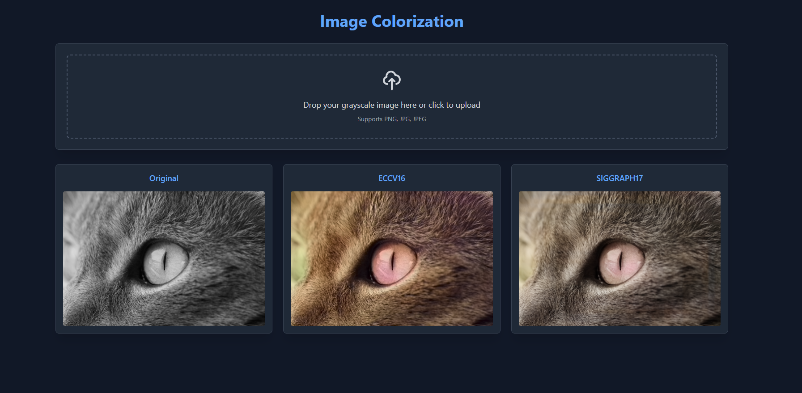

# Image Colorization Web App

A modern web application that colorizes grayscale images using deep learning models. This application provides an easy-to-use interface for colorizing black and white photos using two different AI models: ECCV16 and SIGGRAPH17.



## Features

- 🎨 Multiple colorization models:
  - ECCV16: Classic colorization model
  - SIGGRAPH17: Enhanced colorization with improved color vibrancy
  - Custom: Train your own custom colorization model
- 🌐 Web-based interface with dark theme
- 📤 Drag and drop file upload
- 🖼️ Support for PNG, JPG, and JPEG formats
- 📱 Responsive design for all devices
- ⚡ Real-time processing
- 🧠 Custom model training capabilities

## Installation

1. Clone the repository:
```bash
git clone https://github.com/yourusername/colorization-web.git
cd colorization-web
```

2. Create and activate a virtual environment (recommended):
```bash
python -m venv .venv
# On Windows
.venv\Scripts\activate
# On Unix or MacOS
source .venv/bin/activate
```

3. Install the required dependencies:
```bash
pip install -r requirements.txt
```

## Usage

1. Start the Flask server:
```bash
python app.py
```

2. Open your web browser and navigate to:
```
http://localhost:5000
```

3. Upload your grayscale image by either:
   - Dragging and dropping the image onto the upload area
   - Clicking the upload area to select a file

4. View the colorized results from both models side by side

## Project Structure

```
colorization/
├── app.py              # Flask application
├── colorizers/         # Colorization models
├── static/            
│   ├── results/       # Processed images
│   └── uploads/       # User uploads
├── templates/          # HTML templates
└── requirements.txt    # Python dependencies

training/               # Custom model training
├── model.py           # Custom model architecture
├── dataset.py         # Data loading utilities
├── train.py           # Training script
├── evaluate.py        # Evaluation script
├── colorizer.py       # Integration with main app
├── setup.py           # Environment setup script
└── README.md          # Training documentation
```

## Training Your Own Colorization Model

This project now includes a complete framework for training your own custom colorization models:

1. Set up the training environment:
```bash
cd training
python setup.py --all
```

2. Train a custom model:
```bash
python train.py --data_dir training/data
```

3. Evaluate your model:
```bash
python evaluate.py --data_dir path/to/test/images --model_path training/checkpoints/best_model.pth
```

4. Integrate with the main app:
```bash
python colorizer.py
```

For detailed instructions on training custom models, see the [training README](training/README.md).

## Technical Details

- **Backend**: Flask (Python)
- **Frontend**: HTML5, TailwindCSS
- **Models**: PyTorch-based colorization models
  - ECCV16: Learning Representations for Automatic Colorization
  - SIGGRAPH17: Real-Time User-Guided Image Colorization
  - Custom: User-trained colorization model with attention mechanism

## Requirements

- Python 3.6+
- PyTorch
- Flask
- Other dependencies listed in requirements.txt

## Development

To modify the application:

1. Frontend changes:
   - Edit templates in `templates/index.html`
   - Styling uses TailwindCSS

2. Backend changes:
   - Main application logic in `app.py`
   - Image processing in `colorizers/` directory

3. Model development:
   - Training framework in `training/` directory
   - Custom model architecture in `training/model.py`

## License

This project is licensed under the MIT License - see the LICENSE file for details.

## Acknowledgments

This web interface was built around the colorization models from:
- ECCV 2016 paper: "Colorful Image Colorization"
- SIGGRAPH 2017 paper: "Real-Time User-Guided Image Colorization with Learned Deep Priors"
